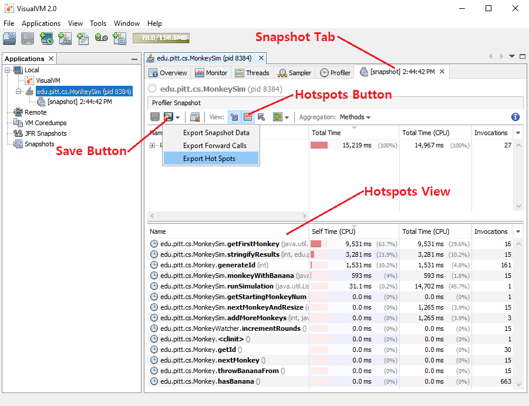

- [Exercise 4 Performance Testing Exercise](#exercise-4-performance-testing-exercise)
  * [Before You Begin](#before-you-begin)
  * [Description](#description)
  * [MonkeySim Requirements](#monkeysim-requirements)
  * [How to Run MonkeySim](#how-to-run-monkeysim)
  * [What to do](#what-to-do)
    + [Profile to Find Candidate Methods](#profile-to-find-candidate-methods)
    + [Refactor Candidate Methods](#refactor-candidate-methods)
    + [Rerun Profile for Refactored Methods](#rerun-profile-for-refactored-methods)
    + [Run Pinning Tests for Candidate Methods](#run-pinning-tests-for-candidate-methods)
- [Submission](#submission)
- [GradeScope Feedback](#gradescope-feedback)
- [Groupwork Plan](#groupwork-plan)
- [Resources](#resources)

# Exercise 4 Performance Testing Exercise
Spring Semester 2024 - Exercise 4

* DUE: February 25 (Sunday), 2024 11:59 PM

**GitHub Classroom Link:** https://classroom.github.com/a/jHEbm9xm

## Before You Begin

Let's start by downloading the VisualVM Java profiler from:
https://visualvm.github.io/

Please click on the download link at the top of the project page.  Keep the
download running as you read the below instructions and install it when it is
ready.  The instasll package is just a ZIP file that you can decompress at a
location of your choice.  Under it, there is a **bin/** directory and within it
are the application binaries.  Try launching the app and if it does not run
properly, please read the troubleshooting guide on the download webpage.  One
common problem is that it complains that there is no compatible JDK found at
launch.  Then, you may have to pass the **--jdkhome "\<path to JDK\>"**
argument as instructed in the webpage, or more preferably, edit the
**etc/visualvm.conf** file found in the installation to uncomment the line, if
you don't want to pass that argument every time:

```
#visualvm_jdkhome=<path to JDK>
```

and replace the \<path to JDK\> with your actual path.  In my machine, the correct setting was:

```
visualvm_jdkhome="C:\Program Files\Eclipse Adoptium\jdk-11.0.21.9-hotspot"
```

## Description

For this exercise, you will test and improve the performance of a monkey
simulation software.  When you are asked to improve the performance of any
code, how would you go about it?  Maybe you will start eyeballing the code to
guess where the program is wasting a lot of its time and try to refactor the
code that way.  But what if your code base is millions of lines long?  Talk
about finding a needle in a haystack.  We will learn to use a technique called
profiling that takes all the guesswork out of the picture.

Profiling is a form of dynamic program analysis where data is collected
during runtime of a program, usually for the purposes of performance
optimization.  The data is typically collected through some form of
instrumentation on the program code, where extra instructions are inserted
specifically for the purposes of monitoring the program while it runs and
collecting data.  For Java, this instrumentation happens at the bytecode
level.  For example, if the profiler wanted to measure how long a method
takes to execute, it may do instrumentation similar to the following:

```
void foo() {
  ___instrumentMethodBegin("foo");
  // body of foo()
  ___instrumentMethodEnd("foo");
}

void ___instrumentMethodBegin(String method) {
  beginTime = ___getTime();
}

void ___instrumentMethodEnd(String method) {
  endTime = ___getTime();
  duration = endTime - beginTime;
  ___addToMethodRunningTime(method, duration);
}
```

But enough of profiling theory, how do I actually use it?  Performance
debugging through profiling is an iterative process.  On each iteration, you
will do the following:

1. Profile the program.  Sort all methods in descending order of CPU utilization and
   search for refactoring opportunities starting from the top.
1. Refactor selected method to be more performant (being careful not to change functionality using pinning tests).
1. Profile again to determine whether you made enough improvement, otherwise go back to 1.

In this way, on each iteration, you will be able to focus on the method that
has the most potential for improvement.  It is important to profile at the
beginning of each iteration to get the most up-to-date profile since the
last refactoring may have had non-local effects (impacted the performance of
other methods besides the method refactored).

The code is available under the src/ directory.

## MonkeySim Requirements

Sample runs are shown in the [sample_runs.txt](sample_runs.txt) file.  Note
that I used the **time** utility to measure response time of the application.
For certain arguments such as 27, it takes more than half an hour to complete!
There is obviously something wrong with the implementation that is slowing down
the program.  It is your job to use VisualVM to measure the CPU utilization of
each method to zoom in on the methods that are the culprits!

For those of you who are interested, MonkeySim is a simulation of the Collatz
Conjecture (https://en.wikipedia.org/wiki/Collatz_conjecture).  In summary,
given the following rules:

* There are infinite monkeys numbered #1, #2, #3, etc., and one banana.

* One of the monkeys is in possession of the banana initially.

* The monkey who has the banana shall throw it to another monkey during each round.

* If a monkey is even-numbered (e.g., monkey #2, monkey #4, etc.), then the
  monkey with the banana shall throw the banana to the monkey equal to one-half
of that initial monkey's number `(n / 2)`.  For example, monkey #4 shall throw
the banana to monkey #2, and monkey #20 shall throw the banana to monkey #10.

* If a monkey is odd-numbered (and not monkey #1), the monkey with the banana
  shall throw it to the monkey equal to three times the number of that monkey
plus one `(3n + 1)`.  For example, monkey #5 shall throw the banana to monkey
#16 `((3 * 5) + 1)`.

* If Monkey #1 receives the banana, the game terminates.

The conjecture is that no matter which monkey initially has the banana, Monkey
#1 will eventually catch the banana in a finite amount of time.  Nobody has
been able to find an initial monkey which behaves otherwise, but nobody has
been able to prove that such a monkey does not exist either (which is why it is
called a conjecture)!

Now, in the process of optimizing this code, it is important that you do not
break its functionality.  Unfortunately, this is legacy code and the
requirements document that specify its functionality were lost (or never
written to begin with!).  But you do know that there are lots of users and
dependent software that rely on the correct functioning of MonkeySim, whatever
it is.  What to do?  The safe course of action is to change nothing and nothing
at all in terms of functionality.  In order to guarantee this, you need to
write pinning tests that pin down existing behavior.  For the exercise, I did
this on your behalf as a demonstration and named the JUnit test
**MonkeySimPinningTest.java**.  All you need to do for the exercise is to run the
test suite every time you refactor the code to make sure you didn't break
anything.  Considerations when writing the pinning tests are detailed in the
pinning test section below.

## How to Run MonkeySim

Let's first invoke the Maven test-compile phase to generate class files for
both the main and test source code folders:

```
mvn test-compile
```

Then you can execute MonkeySim using the exec-maven-plugin included in the
pom.xml file, passing 4 as an argument in this example, or passing as argument
any other desired starting monkey number:

```
mvn exec:java "-Dexec.args=4"
```

## What to do


### Profile to Find Candidate Methods

In order to determine the "hot spots" of the application, you will need to run
a profiler such as VisualVM.  Using the profiler, determine a method you can
modify to measurably increase the speed of the application without modifying
behavior.

Please run the below commandline for profiling purposes.

```
mvn exec:java "-Dexec.args=23"
```

I will demonstrate how to profile in class, but if you need a refresher here
are two helpful guides:

Overview of VisualVM: https://docs.oracle.com/javase/8/docs/technotes/guides/visualvm/applications_local.html

Guide to using Profiling: https://docs.oracle.com/javase/8/docs/technotes/guides/visualvm/profiler.html

Follow these steps in order to attach VisualVM to your running application.
Yes, you first have to run your application before you can attach VisualVM.

1. No matter how quick you are in attaching VisualVM, you will have missed a
   few seconds of program execution in the beginning.  To capture the entirety
of execution please insert a 30 second sleep() at the beginning of the main()
method:

   ```
   try {
      Thread.sleep(30000);
   } catch (InterruptedException iex) {
   }
   ```

   If you are able to attach VisualVM within the 30 seconds, all methods
would be instrumeted with time measuring instructions by the time the
program resumes.

1. After inserting the sleep, launch the app using the given commandline.

   ```
   mvn exec:java "-Dexec.args=23"
   ```

1. When the org.codehaus.plexus.classworlds.launcher.Launcher app shows up on
the left panel, double click on it, or right click on it then click "Open" in
the context menu, to open the app for profiling.

1. Then click on the "Profiler" tab to open the Profiler window.

1. Then in the "Profile classes:" box under "CPU settings", replace the
contents with the following string:

   ```
   edu.pitt.cs.**
   ```

   This will direct VisualVM to only profile classes that matches the above
pattern (the \*\* is a wild card), and not other classes (such as classes
inside the maven-exec-plugin).

1. Then click on the "CPU" button to start profiling CPU usage.  Once you click
on the button, you should see the status message "profiling running (12 methods
instrumented)" below the button.  You need to perform all these steps within
the 30 second sleep window given above.  If you need more time, just extend the
sleep window.  If all goes well, your VisualVM window should look like below:

   


1. After the app wakes up, you will see profile information continue to get
collected as the program is running.  Snapshots allow you to freeze the profile
at a certain point of time so that you can analyze it later.  You can also save
a snapshot to a file for later analysis.  Please review the below guide:

   https://docs.oracle.com/javase/8/docs/technotes/guides/visualvm/snapshots.html

   VisualVM automatically asks whether to take a snapshot at the end of program
execution.  In our case, we want to profile the entire run, so we will wait
until the end to generate a snapshot.

After opening the snapshot tab, click on the "Hot spots" button to get a list
of hot spot methods.  Make sure the "Hot spots" view lists the methods sorted
in descending order of running time (Self Time).  Now let's try saving the hot
spots list to a file.  You can export by clicking on the down arrow beside the
save button (that looks like a floppy disk) to pull down the menu and then
clicking on "Export Hotspots".  You are given an option between CSV, HTML, XML,
and PNG.  Choose the PNG option and save to a file named
**hotspots-before.png**.  Refer to the below figure while following these
instructions.



The exported hotspots-before.png file should look like the following:


The exact runtimes will be different for you since we are running on different
machines but the ranking should look similar.  I want you to refactor **four** of
the most time consuming methods in MonkeySim, looking at the profile.

Now, given a method such as getFirstMonkey, you may want to know in
which context that method was called before starting optimization.  If you
right click on one of the methods in the "Hot spots" methods list, you'll get a
context menu.  If you click on a the "Find in Forward Calls" item, you can see
the call tree that got you to that method.

### Refactor Candidate Methods

Now you are ready to modify the candidate method.  Remember, the program should
work EXACTLY the same as before, except it should be faster and take up less
CPU time.  

When refactorng the four methods, you should not change the behavior of any of
the methods; only refactor the implementation so that they are more efficient.
Three of the methods will be very straightforward because they contain
obviously redundant computation.

One method (generateId) is less straightforward.  All the computation seems
necessary to generate the monkey IDs that are displayed in the output.  Naively
removing the ID generation will result in a different output.  Hint: Do we
really need to generate all those IDs for the output?

Make sure that all the pinning tests pass after you are done.

### Rerun Profile for Refactored Methods

Now that you are done optimizing, rerun the profile again with the same
argument and see if you made a satisfactory difference:

```
java -cp target/classes edu.pitt.cs.MonkeySim 23
```

Repeat the steps described above to generate a new hot spots list named
**hotspots-after.png**. This is what I got after optimizing:


Note that I achieved marked improvement for all four candidate methods.  You
should see similar improvements.  If you do, this is when you pat yourself on
the back and declare victory.

### Run Pinning Tests for Candidate Methods

After refactoring a candidate method to improve performance, you need a
guarantee that the functional behavior of the program did not change due to the
refactoring.  We learned that writing pinning tests and running them after
every code change is a way of guaranteeing this.  Lucky for you, I have already
wrote a set of pinning tests for you in the file **MonkeySimPinningTest.java**
using JUnit.  You can run them as part of the Maven test lifecycle phase as
before:

```
mvn test
```

Make sure they pass with output like the following:

```
...
-------------------------------------------------------
 T E S T S
-------------------------------------------------------
Running edu.pitt.cs.MonkeySimPinningTest
Tests run: 5, Failures: 0, Errors: 0, Skipped: 0, Time elapsed: 5.755 sec

Results :

Tests run: 5, Failures: 0, Errors: 0, Skipped: 0

[INFO] ------------------------------------------------------------------------
[INFO] BUILD SUCCESS
[INFO] ------------------------------------------------------------------------
...
```

The tests pass with the original MonkeySim, obviously because the pinning tests
were based on the existing behavior of MonkeySim to begin with.  Your job is to
make sure that they stay that way while refactoring.

Now let's look at the @Before setUp() method in MonkeySimPinningTest.java
because there a few interesting things to note there:

1. Note how I redirected the output stream for testing purposes:

    ```
    // Back up the old output stream
    stdout = System.out;
    // Redirect the output stream
    System.setOut(new PrintStream(out));
    ```

    This was done to be able to test system output.  In the last test
testArgument5RunSimulation(), lines printed to the screen using
System.out.println can now be compared to a String.  I also made sure I
restored the original output stream in the @After teadDown() method:

    ```
    System.setOut(stdout);
    ```

    Please read textbook Chapter 14.6 Testing System Output, for further
explanation.

1. Note how I used Java Reflection to force reset Monkey.monkeyNum, which is a
   private static field, to 0:

    ```
    Field f = Monkey.class.getDeclaredField("monkeyNum");
    f.setAccessible(true);
    f.set(null, 0);
    ```

    Previously, we have called private methods, but this is the first time we
accessed a private field.  The field is first made accessible and then set to 0.
The first instance argument in f.set(null, 0) is null because this is a
static field and there is no instance.  Please see textbook Chapter 24
Using Reflection to Test Private Methods in Java, for related material.

    Legacy code is often not written with ease-of-testing in mind and the same
goes for this one.  Monkey.monkeyNum is the monkey number assigned to a newly
created monkey and is incremented by one each time so that each monkey in the
list will get a monotonically increasing number.  The developer did not think
to put in a method to be able to reset Monkey.monkeyNum to 0, because it's not
needed for the program itself as the monkey list is only created once.  But in
a test scenario, we need to constantly reset Monkey.monkeyNum to 0 as we
repeatedly recreate the list of monkeys in our setUp() method.  So we are
forced to use Java reflection to force reset that number.

1. Note how I used real objects instead of mocked objects, even for external
   classes when I initialized the test fixture.  You may ask: isn't this
against all we learned about unit testing?  Are we not de facto testing large
parts of the system beyond the unit by not mocking and stubbing?  Yes,
absolutely!  In fact, I made the conscious choice of doing integration testing
instead of unit testing for the pinning tests.  This is often done when you
receive legacy code without any unit testing infrastructure.  Rather than look
for "seams" in the code to construct unit tests and emulating behavior of
mocked objects, which is time consuming, end-to-end systems tests are slapped
on for the purposes of pinning down existing behavior, which is much easier.
Eventually, unit pinning tests are added into the mix, by finding seams or
potentially modifying the code to create seams using dependency injection and
other techniques.  But when code modification is performed, it is done under
the cover of systems pinning tests so any divergence in system behavior would
be detected.

    For Deliverable 4, I will ask **you** to write pinning tests yourself.  And
for these pinning tests, I'm going to ask you to write unit pinning tests.

# Submission

Each pairwise group will do one submission to GradeScope as usual.  The
submitting member must use the "View or edit group" link at the top-right
corner of the assignment page after submission to add his/her partner.  

The submission is divided into two parts:

1.  Submit the repository created by GitHub Classroom for your team to
    GradeScope at the **Exercise 4 GitHub** link.  Once you submit, GradeScope
will run the autograder to grade you and give feedback.  If you get deductions,
fix your code based on the feedback and resubmit.  Repeat until you don't get
deductions.

1. Please use the [ReportTemplate.docx](ReportTemplate.docx) file provided in
   this directory to write a short report.  A PDF version of the file is at
[ReportTemplate.pdf](ReportTemplate.pdf).  On the first page, attach
hotspots-before.png generated before refactoring.  On the second page, attach
hotspots-after.png generated after refactoring.  Submit the report to
GradeScope at the **Exercise 4 Report** link.  

# GradeScope Feedback

It is encouraged that you submit to GradeScope early and often.  Please use the
feedback you get on each submission to improve your code!  All the tests have
been performed after having called the @Before setUp() method which sets up the
test fixture with Monkey #5 having the banana initially (just like when
argument 5 has been passed on the commandline).

The GradeScope autograder works in 2 phases:

1. MonkeySim method pinning tests

   These are the JUnit pinning tests in MonkeySimPinningTest applied to Monkey
sim.  They all pass with the original MonkeySim and they should stay that way.

1. MonkeySim method performance tests

   These are JUnit tests that I wrote to see if you made improvements on the
four most time consuming methods in MonkeySim.  I set a timeout of 10 ms for
each of them and if you don't complete the task within that amount of time, the
test fails.  I also test the entire program using runSimulation() after setting
up the monkey list to begin with monkey #5.  The simulation has a timeout of
300 ms.  You could potentially try to glean the time consuming methods from
looking at the methods that I test, but please don't do that.  See if you can
extract that information from the VisualVM tool.  The test output will not be
so revealing on your deliverable!

# Groupwork Plan

I expect each group member to try running VisualVM and experience profiling
for him/herself.  I created individual repositories for each of you, so
optimize your own code afrer profiling.  After both of you are done, compare
the four methods that each of you optimized.  Discuss, resolve any
differences, and submit.

# Resources

* VisualVM Download:  
https://visualvm.github.io/download.html

* VisualVM Documentation:  
https://visualvm.github.io/documentation.html

Method profiling is not the only thing that VisualVM knows how to do.  It can
also profile overall CPU usage, heap memory usage, thread creation/termination,
class loading/unloading, Java just-in-time compiler activity, etc.  It can also
profile heap memory in a detailed way to show which types of objects are
filling the memory and where their allocation sites were.  And needless to say,
VisualVM is not the only profiling tool out there.

In the unlikely case you can't find what you are looking for in existing
profilers, you can even write your own profiler using the Java Virtual Machine
Tool Interface (JVMTI).  JVMTI is what was used to build VisualVM.

* Creating a Debugging and Profiling Agent with JVMTI  
https://www.oracle.com/technical-resources/articles/javase/jvmti.html

* JVMTI Reference  
https://docs.oracle.com/javase/8/docs/platform/jvmti/jvmti.html
