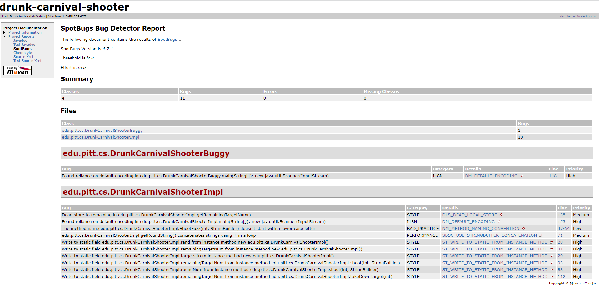
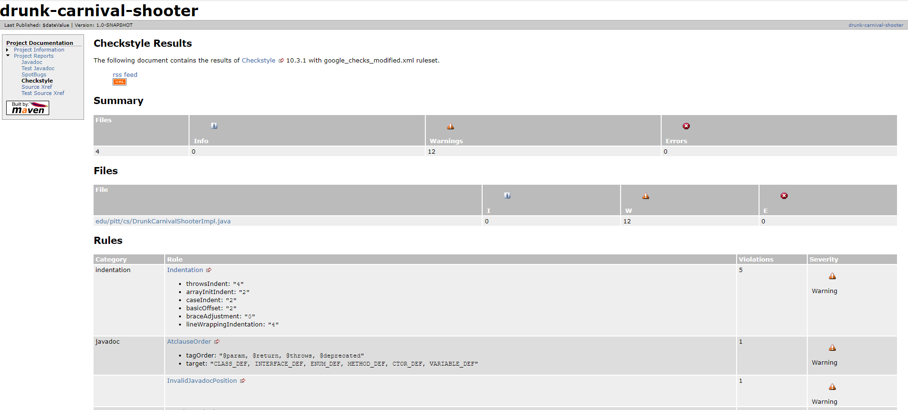
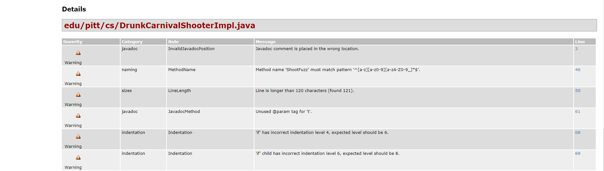
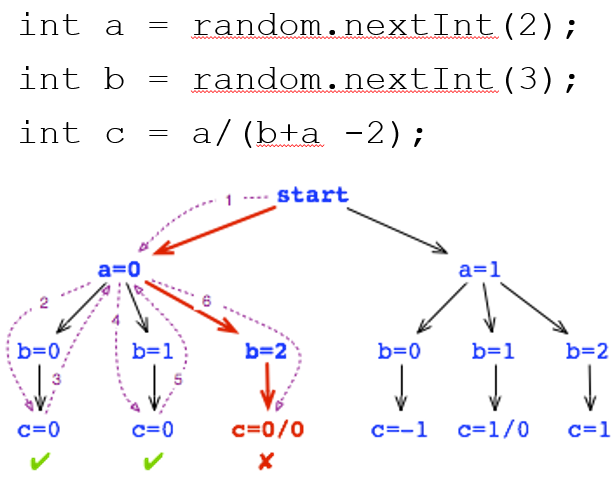

- [Exercise 5 - Static Analysis Part 1: Linters and Bug Finders](#exercise-5---static-analysis-part-1-linters-and-bug-finders)
  * [Description](#description)
  * [DrunkCarnivalShooter](#drunkcarnivalshooter)
  * [Apply SpotBugs and CheckStyle](#apply-spotbugs-and-checkstyle)
    + [SpotBugs Report](#spotbugs-report)
    + [CheckStyle Report](#checkstyle-report)
  * [Try rerunning the application](#try-rerunning-the-application)
  * [Lessons on Pattern Matching](#lessons-on-pattern-matching)
  * [Submission](#submission)
  * [Resources](#resources)
- [Exercise 5 - Static Analysis Part 2: Model Checking](#exercise-5---static-analysis-part-2-model-checking)
  * [Applying Java Pathfinder (JPF)](#applying-java-pathfinder-jpf)
    + [Applying JPF on Rand](#applying-jpf-on-rand)
    + [Applying JPF on DrunkCarnivalShooter](#applying-jpf-on-drunkcarnivalshooter)
    + [Applying JPF on JUnit to Unit Test DrunkCarnivalShooter](#applying-jpf-on-junit-to-unit-test-drunkcarnivalshooter)
    + [Lessons on Model Checking](#lessons-on-model-checking)
  * [Submission](#submission-1)
  * [GradeScope Feedback](#gradescope-feedback)
  * [Resources](#resources-1)
- [Groupwork Plan](#groupwork-plan)
- [Exercise 5 - Static Analysis Extra Credit](#exercise-5---static-analysis-extra-credit)

# Exercise 5 - Static Analysis Part 1: Linters and Bug Finders

Spring Semester 2024 - Exercise 5

* DUE: March 24 (Sunday), 2024 11:59 PM

**GitHub Classroom Link:** https://classroom.github.com/a/4wJoAufz

## Description

In this exercise, you will use two static analysis tools to test a program: a
bug finder named SpotBugs and a linter named CheckStyle, SpotBugs and
CheckStyle work in similar ways in that both look for patterns that are either
symptomatic of a bug (former) or are bad coding style (latter).  So we will
look at them together first.  Later in Part 2, we will do model checking using
the Java Path Finder (JPF) which is much more rigorous in proving a program
correct.

## DrunkCarnivalShooter

DrunkCarnivalShooter is a simple text-based game where the player goes to a
carnival shooting range and tries to win the prize by shooting all 4 provied
targets.  The player can designate what target to shoot for pressing 0-3.  But
since the player is drunk, there is an equal chance of the player shooting left
or right as shooting straight.  Refer to the file
[sample_run.txt](sample_run.txt) for an example game play session.  You can
also try playing it yourself using the reference implementation:

```
java -jar DrunkCarnivalShooter.jar
```

To run the DrunkCarnivalShooter using the current implementation, you first need compile it.

```
mvn compile
```

Then run the following commandline:

```
java -cp target/classes edu.pitt.cs.DrunkCarnivalShooterImpl 
```

Now the current implementation contains several bugs.  In fact, the game throws
an exception immediately at start up:

```
$ java -cp target/classes edu.pitt.cs.DrunkCarnivalShooterImpl
Exception in thread "main" java.lang.NullPointerException
        at edu.pitt.cs.DrunkCarnivalShooterImpl.<init>(DrunkCarnivalShooterImpl.java:33)
        at edu.pitt.cs.DrunkCarnivalShooterImpl.main(DrunkCarnivalShooterImpl.java:152)
```

In this exercise, we are going to try to debug the program using static
analysis instead of dynamic testing.  So now let's go and try to find some
defects!

## Apply SpotBugs and CheckStyle

As before SpotBugs and CheckStyle have already been added to the Maven [POM](pom.xml)
as plugins.  Note that they have been registered as reporting plugins towards the end.
These reporting plugins are invoked when the Maven "site" lifecycle phase is invoked.

Let's try invoking Maven site ourselves:

```
mvn site
```

If it works properly, you should see the following at the end:

```
...
[INFO] Generating "SpotBugs" report      --- spotbugs-maven-plugin:4.7.1.1:spotbugs
[INFO] Generating "Checkstyle" report    --- maven-checkstyle-plugin:3.1.2:checkstyle
[INFO] Generating "Source Xref" report   --- maven-jxr-plugin:3.0.0:jxr
[INFO] Generating "Test Source Xref" report --- maven-jxr-plugin:3.0.0:test-jxr
[INFO] ------------------------------------------------------------------------
[INFO] BUILD SUCCESS
[INFO] ------------------------------------------------------------------------
...
```

You will also see some Javadoc related errors in the output, but don't worry those
will be fixed by the time we are done linting the code using CheckStyle.

Invoking "mvn site" is going to create a new directory target/site, under which a
website dedicated to this project is generated.  Try opening the "index.html" file at
the root of that directory.  Then navigate to "Project Reports > SpotBugs" or 
"Project Reports > CheckStyle" to naviate to either report respectively.

### SpotBugs Report

"Project Reports > SpotBugs" should look like the following:



On each row is a (potential) bug.  The "Details" column contains an abbreviation of the 
bug type.  Click on the link to view the reference documentation for that bug.  The "Line"
column shows the line number for that bug.  Click on the link to view the location in
actual source code. Please resolve all bugs.  Note that resolving some bugs may uncover
new bugs when you run "mvn site" again.

One of the bug types is going to be "ST_WRITE_TO_STATIC_FROM_INSTANCE_METHOD".
If you view the reference, it is saying that you should not update
a static variable from an instance method.  I have seen many of you do this
in your assignments.  You would declare variables that should really be
instance variables to be static.  I don't know where you picked up that
programming habit, but that goes against all OOP principles.  If you are still
unsure about when to use static and when to use instance variables, here is a
good tutorial:

https://docs.oracle.com/javase/tutorial/java/javaOO/classvars.html

Here is a link to the SpotBugs reference, in case you need it:

https://spotbugs.readthedocs.io/en/latest/bugDescriptions.html

### CheckStyle Report

"Project Reports > CheckStyle" should look like the following:



After the summary information about the number of errors and warnings found, you will see
a list of Rules.  Each row displays the rule category, the rule description, the number of
violations of that rule in the source tree, and the severity.  In the rule description column,
you will see the rule name (e.g. "AtclauseOrder").  The name is linked to a reference document 
for that rule.  It also contains a list of properties applied to that rule.  One property for
the AtclauseOrder rule is "tagOrder" which has the value: "@param, @return, @throws, @deprecated".
If you read the reference, that is the order in which those at-annotations should appear in the
Javadoc comment.  But wait, how do we know that is the correct order?

If we don't specify anything, CheckStyle will by default follow the Sun style of Java coding.
Sun Microsystems, as many of you know, is the company that came up with the Java language and
is now part of Oracle.  But there is no one "correct" style.  Each software organization can
have its own unique style, and this style can be summarized in a set of Rules in XML format.

For this project, I designated a file named [google_checks_modified.xml](google_checks_modified.xml)
as the RUles configuration file that CheckStyle should use in the [POM](pom.xml):

```
      <plugin>
        <groupId>org.apache.maven.plugins</groupId>
        <artifactId>maven-checkstyle-plugin</artifactId>
        <version>3.1.2</version>
        <configuration>
          <configLocation>google_checks_modified.xml</configLocation>
        </configuration>
        ...
      </plugin>
```

As the name implies, I made a few modifications to the Google style for Java.  Now, if you
see inside [google_checks_modified.xml](google_checks_modified.xml), you will see:

```
...
		<module name="AtclauseOrder">
			<property name="tagOrder"
				value="@param, @return, @throws, @deprecated" />
			<property name="target"
				value="CLASS_DEF, INTERFACE_DEF, ENUM_DEF, METHOD_DEF, CTOR_DEF, VARIABLE_DEF" />
		</module>
...
```

And those properties are what is being shown with the AtclauseOrder rule in the report.

If you scroll down beyond the Rules, you will see Details for each warning:



Again, on each row is a "Line" column showing the line number for that warning.  Clicking
on the link will show the location in actual source code. Please resolve all warnings, looking
at the details of the Rule that the warning violated.

Here is a link to the CheckStyle reference, in case you need it:

https://checkstyle.sourceforge.io/checks.html  

## Try rerunning the application

After fixing all the warnings, let's now attempt running the program again:

```
java -cp target/classes edu.pitt.cs.DrunkCarnivalShooterImpl 
```

Now, the program should start up properly:

```
$ java -cp target/classes edu.pitt.cs.DrunkCarnivalShooterImpl 
Round #0:  ||    ||    ||    ||
Choose your target (0-3):
```

Yay!  But we are note done yet.  There are still bugs remaining.  Try repeatedly shooting the first target by choosing 0.

```
Round #0:  ||    ||    ||    ||
Choose your target (0-3):
0

...

Round #3:        ||    ||    ||
Choose your target (0-3):
0
Exception in thread "main" java.lang.ArrayIndexOutOfBoundsException: -1
        at java.util.ArrayList.elementData(ArrayList.java:422)
        at java.util.ArrayList.get(ArrayList.java:435)
        at DrunkCarnivalShooterImpl.isTargetStanding(DrunkCarnivalShooterImpl.java:125)
        at DrunkCarnivalShooterImpl.takeDownTarget(DrunkCarnivalShooterImpl.java:108)
        at DrunkCarnivalShooterImpl.shoot(DrunkCarnivalShooterImpl.java:89)
        at DrunkCarnivalShooterImpl.main(DrunkCarnivalShooterImpl.java:158)
```

The bug does not manifest in a deterministic way due to the randomness but you
will trigger it soon enough.  Or you may encounter another bug where the game
ends prematurely even when there are targets remaining.  These bugs are bugs in
the logic of the program and SpotBugs is not very good at finding these types
of bugs.  It only finds bugs that match a certain pattern.

## Lessons on Pattern Matching

Both linters (CheckStyle) and bug finders (SpotBugs) work by pattern matching.
Pattern matching can be good at finding simple bugs that are recurrent across
projects and can even catch errors in your documentation.  What they are not
good for is finding problems in your program logic (as seen above).  For that,
you need dynamic testing that actually executes the program to check program
behavior.  Or, you can use model checking that is able to *prove* that certain
correctness properties hold for all situations, even for random programs like
this one (see next section).

## Submission

Each pairwise group will do one submission to GradeScope, by *one member* of
the group.  The submitting member will press the "View or edit group" link at
the top-right corner of the assignment page after submission to add his/her
partner.  

When you
are done, submit your github repository to GradeScope at the **Exercise 5 Part
1 GitHub** link.  Once you submit, GradeScope will run the autograder to grade
you and give feedback.  If you get deductions, fix your code based on the
feedback and resubmit.  Repeat until you don't get deductions.

If you don't get any more warnings you've done your job.  Otherwise, it is -1
point for each CheckStyle or SpotBugs warning.

## Resources

* CheckStyle reference:  
https://checkstyle.sourceforge.io/checks.html  

* SpotBugs reference:  
https://spotbugs.readthedocs.io/en/latest/bugDescriptions.html

# Exercise 5 - Static Analysis Part 2: Model Checking

* DUE: March 31 (Sunday), 2024 11:59 PM

In Part 2, you will use a model checker named Java Pathfinder (JPF) to prove
various correctness properties in your program.

* IMPORTANT: You need Java 11 to run the Java Path Finder model checker. Make
  sure you have the correct Java version by doing "java -version" and "javac
-version" before going into the JPF section. Please refer to Exercise 0: Java
Assessment for instructions on how to install JDK 11 and set up your PATH
environment variable.

## Applying Java Pathfinder (JPF)

Java Pathfinder is a tool developed by NASA to model check Java programs.  It
works in exactly the same way we learned in class: it does an exhaustive and
systematic exploration of program state space to check for correctness.

### Applying JPF on Rand

Let's first try out JPF on the simple Rand program that in the
"Static Analysis Part 2" lecture on model checking.



You would have already compiled the code using "mvn compile", so let's get straight to running the code:

```
java -cp target/classes edu.pitt.cs.Rand
```

As we learned in the lecture, the program output is nondeterministic due to the
random number generaiton.  You have to rely on dumb luck to find the defect
which is the divide-by-zero exception on the calculation for "c".

Using JPF, you can *always* deterministically find the defect using systematic
state space exploration.

To run JPF on Rand, first cd into the jpf-core folder:
```
cd jpf-core
```

Then do (runApp.bat for WIndows cmd shell, runApp.sh for Mac/Linux):

```
.\runApp.bat Rand.jpf
```
```
bash runApp.sh Rand.jpf
```

If you see the following output, you are not using Java 11 to run JPF:

```
$ java --add-opens java.base/jdk.internal.misc=ALL-UNNAMED -jar build/RunJPF.jar Rand.jpf 
[SEVERE] JPF configuration error: error instantiating class gov.nasa.jpf.vm.OVHeap for entry "vm.heap.class":
> exception in gov.nasa.jpf.vm.OVHeap(gov.nasa.jpf.Config,gov.nasa.jpf.vm.KernelState):
>> java.lang.NoClassDefFoundError: sun/misc/SharedSecrets
> used within "vm.class" instantiation of class gov.nasa.jpf.vm.SingleProcessVM
[SEVERE] JPF terminated
```

Please check "java -version" again and retry after setting up.

If you see the following output, JPF is running correctly:

```
$ java --add-opens java.base/jdk.internal.misc=ALL-UNNAMED -jar build/RunJPF.jar Rand.jpf
JavaPathfinder core system v8.0 (rev 471fa3b7c6a9df330160844e6c2e4ebb4bf06b6c) - (C) 2005-2014 United States Government. All rights reserved.


====================================================== system under test
edu.pitt.cs.Rand.main()

====================================================== search started: 3/15/24 1:52 PM
computing c = a/(b+a - 2)..
a=0
  b=0       ,a=0
=>  c=0     , b=0, a=0
  b=1       ,a=0
=>  c=0     , b=1, a=0
  b=2       ,a=0

====================================================== error 1
gov.nasa.jpf.vm.NoUncaughtExceptionsProperty
java.lang.ArithmeticException: division by zero
        at edu.pitt.cs.Rand.main(edu/pitt/cs/Rand.java:42)


====================================================== trace #1
------------------------------------------------------ transition #0 thread: 0
gov.nasa.jpf.vm.choice.ThreadChoiceFromSet {id:"ROOT" ,1/1,isCascaded:false}
      [3168 insn w/o sources]
  edu/pitt/cs/Rand.java:31       : System.out.println("computing c = a/(b+a - 2)..");
...
------------------------------------------------------ transition #1 thread: 0
gov.nasa.jpf.vm.choice.IntIntervalGenerator[id="verifyGetInt(II)",isCascaded:false,0..1,delta=+1,cur=0]
      [2 insn w/o sources]
  edu/pitt/cs/Rand.java:34       : int a = random.nextInt(2); // (2)
...
------------------------------------------------------ transition #2 thread: 0
gov.nasa.jpf.vm.choice.IntIntervalGenerator[id="verifyGetInt(II)",isCascaded:false,0..2,delta=+1,cur=2]
      [2 insn w/o sources]
  edu/pitt/cs/Rand.java:39       : int b = random.nextInt(3); // (3)
...
  edu/pitt/cs/Rand.java:42       : int c = a / (b + a - 2); // (4)
a=1
  b=0       ,a=1
=>  c=-1     , b=0, a=1
  b=1       ,a=1

====================================================== error 2
gov.nasa.jpf.vm.NoUncaughtExceptionsProperty
java.lang.ArithmeticException: division by zero
        at edu.pitt.cs.Rand.main(edu/pitt/cs/Rand.java:42)


====================================================== trace #2
------------------------------------------------------ transition #0 thread: 0
gov.nasa.jpf.vm.choice.ThreadChoiceFromSet {id:"ROOT" ,1/1,isCascaded:false}
      [3168 insn w/o sources]
  edu/pitt/cs/Rand.java:31       : System.out.println("computing c = a/(b+a - 2)..");
...
------------------------------------------------------ transition #1 thread: 0
gov.nasa.jpf.vm.choice.IntIntervalGenerator[id="verifyGetInt(II)",isCascaded:false,0..1,delta=+1,cur=1]
      [2 insn w/o sources]
  edu/pitt/cs/Rand.java:34       : int a = random.nextInt(2); // (2)
...
------------------------------------------------------ transition #2 thread: 0
gov.nasa.jpf.vm.choice.IntIntervalGenerator[id="verifyGetInt(II)",isCascaded:false,0..2,delta=+1,cur=1]
      [2 insn w/o sources]
  edu/pitt/cs/Rand.java:39       : int b = random.nextInt(3); // (3)
...
  edu/pitt/cs/Rand.java:42       : int c = a / (b + a - 2); // (4)
  b=2       ,a=1
=>  c=1     , b=2, a=1

====================================================== results
error #1: gov.nasa.jpf.vm.NoUncaughtExceptionsProperty "java.lang.ArithmeticException: division by zero  a..."
error #2: gov.nasa.jpf.vm.NoUncaughtExceptionsProperty "java.lang.ArithmeticException: division by zero  a..."

====================================================== statistics
elapsed time:       00:00:00
states:             new=6,visited=3,backtracked=9,end=4
search:             maxDepth=3,constraints=0
choice generators:  thread=1 (signal=0,lock=1,sharedRef=0,threadApi=0,reschedule=0), data=3
heap:               new=950,released=52,maxLive=619,gcCycles=7
instructions:       3545
max memory:         979MB
loaded code:        classes=66,methods=1371

====================================================== search finished: 3/15/24 1:52 PM
```

Since you enabled both error and trace output on [jpf.properties](jpf-core/jpf.properties):

```
report.console.property_violation=error,trace
```

The console output will include a description of the error whenever a
property violation (i.e. Java exception) occurs, as well as the execution
trace leading up to that error.

You can see from the screen output that JPF systemlatically explores all
possible states, thereby finding the two states with division-by-0 exception
errors.  So, now we know that there are two defective states, how do we
debug?  By looking at the trace corresponding to each error, you can see all
the Java statement executed leading up to the error and all the choices it
has made at points where there are nondeterministic choices.  The choices
are marked as "transitions" in the trace.

Let's take a close look at trace #1.  Transition #0 happens with
ThreadChoiceFromSet.  At this point JPF chooses one thread to start
executing out of all the threads in the program (to try out all the possible
thread interleavings as we discussed in class).  In this case, it is a
single-threaded program, so there is only thread to choose from: the main
thread.

Transition #1 looks like the following:
```
gov.nasa.jpf.vm.choice.IntIntervalGenerator[id="verifyGetInt(II)",isCascaded:false,0..1,delta=+1,cur=0]
```
The IntIntervalGenerator enumerates all integers in a range of values and
goes down the program path for each generated integer.  You can see that it
was invoked in response to the following program statement:
```
  Rand.java:34                   : int a = random.nextInt(2); // (2)
```
What JPF does is to generate two integers in the range "0..1" with a delta
of 1, so two integers 0 and 1.  It will try out both possibilities.  The
current choice is given in "cur=0".  So you can tell that the error occurred
when "int a = 0;".

If you follow trace #1 using this logic, you can tell that the first
divide-by-zero exception occurred when a = 0 and b = 2.  If you follow trace
#2, you can tell that the second exception occurred when a = 1 and b = 1.
In this way, even without the help of program output, you can trace through
the code and identify why each error occurred.

### Applying JPF on DrunkCarnivalShooter

Now let's cd out of the Rand directory to the root directory to once again work
on DrunkCarnivalShooter.  The following command applies JPF to the program.

To run JPF on DrunkCarnivalShooter do (.bat for WIndows, .sh for Mac/Linux):

```
.\runApp.bat DrunkCarnivalShooter.jpf
```
```
bash runApp.sh DrunkCarnivalShooter.jpf
```

But stop right there.  If you run that command, you will fall into an
infinite loop at this point!

That is because in the DrunkCarnivalShooterImpl main method, if the argument
"test" is passed (meaning that we are in JPF test mode), I remove all
calls to Scanner which scans user input, and hard coded the user selected
target to "1" when in test mode:

```
Scanner scanner = null;
if (args.length == 1 && args[0].equals("test")) {
    // Do not create an input scanner when running with JPF.
} else {
    scanner = new Scanner(System.in);
}
while (true) {
    System.out.println(shooter.getRoundString());
    System.out.println("Choose your target (0-3): ");
    int t = 1;
    if (scanner == null) {
        // TODO: Enumerate all possible values of t using JPF Verify.
    } else {
        t = scanner.nextInt();
    }
    // Shoot the target
    ...
}
```

Why did I have to do this?  That is because JPF is not designed to take user
input.  If it were to take user input, then the test coverage of JPF will be
beholden to what input the user chooses.  The goal of JPF (and any other
model checker) is to verify the program **regardless of user input**.

JPF provides a set of APIs under the Verify class (gov.nasa.jpf.vm.Verify)
to specify the set of user input(s) we want to test.  Then, it **exhaustively
tests the program for each user input**, by creating a new path to explore
for each input.

The reason that JPF falls into an infinite loop in this case is because the
t is hard coded to 1, and by repeatedly choosing target 1, the game is never
going to terminate.  Now not all programs with infinite loops generate an
infinite number of program states, so there is something about this program
that generates an infinite number of states... but more on that later. :)

For now, let's use the Verify APIs to fix the problem.  In order to be able
to use them, we first have to import the class at the top of
DrunkCarnivalShooterImpl.java:

```
import gov.nasa.jpf.vm.Verify;
```

In terms of the code, all you have to do is on the // TODO comment, call:

```
t = Verify.getInt(0, 3);
```

The above will direct JPF to generate 4 states each where t is set to 0, 1, 2,
or 3 respectively.  Then it will systematically explore each state.  If you
wish, you can test a larger set of numbers beyond 0-3.  It is just going to
generate more states and take longer (the flipside being you will be able to
model check your program against a larger set of inputs).

Now let's recompile:

```
mvn compile
```

And try running JPF one more time:

```
.\runApp.bat DrunkCarnivalShooter.jpf
```
```
bash runApp.sh DrunkCarnivalShooter.jpf
```

This will show a new error message due to an exception:

```
====================================================== search started: 3/15/24 4:24 PM
Round #0:  ||    ||    ||    ||  
Choose your target (0-3):

====================================================== error 1
gov.nasa.jpf.vm.NoUncaughtExceptionsProperty
java.lang.ArrayIndexOutOfBoundsException: -1
        at java.util.ArrayList.elementData(java/util/ArrayList.java:424)
        at java.util.ArrayList.get(java/util/ArrayList.java:437)
        at edu.pitt.cs.DrunkCarnivalShooterImpl.isTargetStanding(edu/pitt/cs/DrunkCarnivalShooterImpl.java:127)
        at edu.pitt.cs.DrunkCarnivalShooterImpl.takeDownTarget(edu/pitt/cs/DrunkCarnivalShooterImpl.java:111)
        at edu.pitt.cs.DrunkCarnivalShooterImpl.shoot(edu/pitt/cs/DrunkCarnivalShooterImpl.java:92)
        at edu.pitt.cs.DrunkCarnivalShooterImpl.main(edu/pitt/cs/DrunkCarnivalShooterImpl.java:173)
...
```

Wait, this is the same exception that we randomly experienced previously!  Use
the trace generated as part of the output to find the input value(s) and the
random value(s) that led to the exception.  Interpret it in the same way you
did Rand.trace.  The trace should look like:

```
====================================================== trace #1
------------------------------------------------------ transition #0 thread: 0
gov.nasa.jpf.vm.choice.ThreadChoiceFromSet {id:"ROOT" ,1/1,isCascaded:false}
      [6345 insn w/o sources]
  edu/pitt/cs/DrunkCarnivalShooterImpl.java:153 : DrunkCarnivalShooterImpl shooter = new DrunkCarnivalShooterImpl();
...
------------------------------------------------------ transition #1 thread: 0
gov.nasa.jpf.vm.choice.IntIntervalGenerator[id="verifyGetInt(II)",isCascaded:false,0..3,delta=+1,cur=0]
      [2 insn w/o sources]
  edu/pitt/cs/DrunkCarnivalShooterImpl.java:166 : t = Verify.getInt(0, 3);
...
------------------------------------------------------ transition #2 thread: 0
gov.nasa.jpf.vm.choice.IntIntervalGenerator[id="verifyGetInt(II)",isCascaded:false,0..2,delta=+1,cur=0]
      [2 insn w/o sources]
  edu/pitt/cs/DrunkCarnivalShooterImpl.java:48 : int offsetNum = rand.nextInt(3) - 1;
...
```

The trace represents all the Java instructions that have executed up to the
point of the failure.  Now let's try to break down that trace.  A transition
happens in the course of travering the program state space.  Whenever there
is a "choice" between one more program states, a transition is recorded with
the selected choice.  When is JPF presented with a choice?

1. When it encounters Verify.getInt, it is presented with a range of user
   inputs each of which represents a separate path that JPF can take.  Same
thing applies to all the other Verify APIs.

1. When it encounters Random.nextInt, it is presented with a range of random
   values that the random number generator can return, each of each again
represents a different program state.

1. When the program is multithreaded (parallel), JPF is also presented at each
   instruction with a choice of whether to context switch and execute another
thread.  This is what transition #0 is.  This is how JPF can exhaustively
explore all thread interleavings.  If you don't know what that means, don't
worry about it.  It is beyond the scope of this class.  Feel free to ask if you
are curious :).

In the above trace, it is important to understand transitions #1 and #2.  What
would be transition #1 with choice interval 0..3?  It would be the
Verify.getInt(0, 3) that replaced the scan of user input.  And according to the
trace it returned 0 ("cur=0").  What would be transition #2 with choice
interval 0..2?  It would be the rand.nextInt(3) used to add randomness to the
shooting target, and in the trace it also returned 0 ("cur=0").  So it's the
case where the user chose target 0 and the randomness of the shooting pulled
the bullet to the left.  What's on the left side of target 0?  That should help
you track down the problem.  **Hint: What happens when t becomes -1 in isTargetStanding?**

Once you fix these bugs, try running JPF one more time (but be ready to quickly press Ctrl+C
because it is going to fall into an infinite loop):

```
mvn compile
```

Then one of the below:

```
.\runApp.bat DrunkCarnivalShooter.jpf
```
```
bash runApp.sh DrunkCarnivalShooter.jpf
```

Press Ctrl+C now, or your process is going to run out of memory!  Since JPF does 
not encounter any exceptions it will run indefinitely and also generate an infinite
number of states (observed by the infinite number of rounds):

```
...
Round #20:
  ||    ||    ||
Choose your target (0-3):
You aimed at target #0 but the Force pulls your bullet to the left.
You miss! "Do or do not. There is no try.", Yoda chides.

Round #21:
        ||    ||    ||
Choose your target (0-3):
You miss! "Do or do not. There is no try.", Yoda chides.

... (to infinity)
```

There is no theoretical limit to the number of rounds a player can play, hence
the state explosion.  How can I deal with this explosion and still verify my
program?

We have to somehow narrow down the amount of state we test, or we will be
forced to but JPF off after testing only a limited set of rounds.  Let's say
the state that we are really interested in relation to the specifications is
the state of the 4 targets.  Now if you think about it, the 4 targets can only
be in a handful of states: 2 * 2 * 2 * 2 = 16 states (standing or toppled for
each).  And this is true no matter how many rounds you go through.  The only
thing that constantly changes every round is the round number --- and that is
the culprit leading to the state explosion.  The round number is not something
we are interested in verifying right now.  So, let's filter that state out!

Import the appropriate JPF library at the top of DrunkCarnivalShooterImpl.java again:

```
import gov.nasa.jpf.annotation.FilterField;
```

And now, let's annotate roundNum such that it is filtered out:

```
@FilterField private int roundNum;
```

Now if we run runJPF.bat again, JPF will only go up to Round #2 and stop and declare "no errors detected".

```
...
Round #2:

Choose your target (0-3):

====================================================== results
no errors detected
```

But why Round #2?  We would expect that 4 rounds would be needed to cover all
the 16 possible states.  In fact, if you see the output, you can see it does
not cover all the possible 16 states.  And somehow the game is able to
terminate after 2 rounds.  So the game now does not throw any exceptions but
still malfunctions.

JPF can only check for systems properties that it knows about while traversing
the program state space.  If you don't tell it anything, the only thing JPF
knows about a Java program is that it should not throw exceptions at any point.
If you want to check that your program behaves in a certain way according to
the requirements, you need to tell JPF about these additional properties.  The
way to encode properties is though assertions that assert the given invariant
property at that point of execution.  There are two options to insert these
assertions:

1. The assertions be embedded in your program code in the form of Java
   assert statements.  It is sometimes useful to have these assertions
checked while your system is deployed in the production site, especially if
the assertions can prevent a catastrophic event.  But this has the drawback
that your testing code is mixed in with your implementation code which is
not good for code readability and/or maintenance.  

1. The other option is to use JPF as part of the JUnit testing framework.
   JUnit will check for defects by checking postconditions using JUnit
assertions, just like with regular unit testing.  But each of the JUnit tests
become comprehensive and exhaustive thanks to JPF, even in the face of random
program behavior.  JPF makes sure that the invariant assertion holds for all
the random behaviors the program can display.  It also does this for all
possible user inputs if the Verify API is used.

We will choose the latter option.

### Applying JPF on JUnit to Unit Test DrunkCarnivalShooter

In this section, we are going to be working on the
DrunkCarnivalShooterTest.java JUnit class, and in order to recompile the
code after modifications, you need to do:

```
mvn test-compile
```

Invoking the Maven test-compile phase will build the JUnit files under the
src/test directory, along with the implementation files under the src/main
diretory.


To run JPF on DrunkCarnivalShooterTest, do (.bat for WIndows, .sh for Mac/Linux):

```
.\runTest.bat edu.pitt.cs.DrunkCarnivalShooterTest
```
```
bash runTest.sh edu.pitt.cs.DrunkCarnivalShooterTest
```

As of now, it should show one test method "testShoot" passing:

```
$ java --add-opens java.base/jdk.internal.misc=ALL-UNNAMED -jar build/RunTest.jar edu.pitt.cs.DrunkCarnivalShooterTest

......................................... testing testShoot()
  running jpf with args:
JavaPathfinder core system v8.0 (rev 1a704e1d6c3d92178504f8cdfe57b068b4e22d9c) - (C) 2005-2014 United States Government. All rights reserved.


====================================================== system under test
edu.pitt.cs.DrunkCarnivalShooterTest.runTestMethod()

====================================================== search started: 3/19/24, 1:34 AM
[WARNING] orphan NativePeer method: jdk.internal.misc.Unsafe.getUnsafe()Lsun/misc/Unsafe;
Failure in Round #0:                         (targetChoice=0):

====================================================== results
no errors detected

====================================================== search finished: 3/19/24, 1:34 AM
......................................... testShoot: Ok

......................................... execution of testsuite: edu.pitt.cs.DrunkCarnivalShooterTest SUCCEEDED
.... [1] testShoot: Ok
......................................... tests: 1, failures: 0, errors: 0

tested classes: 1, passed: 1
```

As of now, DrunkCarnivalShooterTest.java is incomplete and does not do much.
Fill in the locations with // TODO comments inside.  In the setUp method, use
the Verify API such that you enumerate all the 16 possible states that the game
can be in, as well as the target choice made by the user (0-3).  In this way,
each of your JUnit test cases will be tested on all possible states the game
can be in with all possible user inputs.

In the testShoot() method, implement the preconditions, execution steps, and
the invariant to test the shoot(targetChoice, builder) method as explained in
the method comment.  The invariant is a property that must hold no matter the
game state and the target choice.  For this test, the invariant chosen was the
remaining number of targets, because it appears that the game is ending
prematurely thinking that there aren't any more targets.

I recommend that you always insert the failString that I initialized for you in
the setUp method as the first argument of any JUnit assert call so that you get
that as part of your failure message.  For example,

```
assertEquals(failString, expected value, observed value);
```

The failString tells you the combination of game state and target choice that
led to the failure, which helps you debug the problem.  Feel free to append
additional information to the failString that may help you debug.

Now, try running the JUnit test again on top of JPF:

```
.\runTest.bat edu.pitt.cs.DrunkCarnivalShooterTest
```
```
bash runTest.sh edu.pitt.cs.DrunkCarnivalShooterTest
```

If you implemented the test properly, it should produce an assertion failure
and the trace leading up to it:

```
$ java --add-opens java.base/jdk.internal.misc=ALL-UNNAMED -jar build/RunTest.jar edu.pitt.cs.DrunkCarnivalShooterTest

......................................... testing testShoot()
  running jpf with args:
JavaPathfinder core system v8.0 (rev 1a704e1d6c3d92178504f8cdfe57b068b4e22d9c) - (C) 2005-2014 United States Government. All rights reserved.


====================================================== system under test
edu.pitt.cs.DrunkCarnivalShooterTest.runTestMethod()

====================================================== search started: 3/19/24, 2:08 AM
[WARNING] orphan NativePeer method: jdk.internal.misc.Unsafe.getUnsafe()Lsun/misc/Unsafe;

====================================================== error 1
gov.nasa.jpf.vm.NoUncaughtExceptionsProperty
java.lang.AssertionError: Failure in Round #0:        ||               (targetChoice=0):
        at gov.nasa.jpf.util.test.TestJPF.fail(gov/nasa/jpf/util/test/TestJPF.java:164)
        at gov.nasa.jpf.util.test.TestJPF.assertEquals(gov/nasa/jpf/util/test/TestJPF.java:1054)
        at edu.pitt.cs.DrunkCarnivalShooterTest.testShoot(edu/pitt/cs/DrunkCarnivalShooterTest.java:126)
        at java.lang.reflect.Method.invoke(gov.nasa.jpf.vm.JPF_java_lang_reflect_Method)
        at gov.nasa.jpf.util.test.TestJPF.runTestMethod(gov/nasa/jpf/util/test/TestJPF.java:648)


====================================================== trace #1
------------------------------------------------------ transition #0 thread: 0
gov.nasa.jpf.vm.choice.ThreadChoiceFromSet {id:"ROOT" ,1/1,isCascaded:false}
...
------------------------------------------------------ transition #1 thread: 0
gov.nasa.jpf.vm.choice.IntIntervalGenerator[id="verifyGetInt(II)",isCascaded:false,0..3,delta=+1,cur=0]
...
------------------------------------------------------ transition #2 thread: 0
gov.nasa.jpf.vm.BooleanChoiceGenerator[[id="verifyGetBoolean",isCascaded:false,{>false,true}]
...
------------------------------------------------------ transition #3 thread: 0
gov.nasa.jpf.vm.BooleanChoiceGenerator[[id="verifyGetBoolean",isCascaded:false,{false,>true}]
...
------------------------------------------------------ transition #4 thread: 0
gov.nasa.jpf.vm.BooleanChoiceGenerator[[id="verifyGetBoolean",isCascaded:false,{>false,true}]
...
------------------------------------------------------ transition #5 thread: 0
gov.nasa.jpf.vm.BooleanChoiceGenerator[[id="verifyGetBoolean",isCascaded:false,{>false,true}]
,,,
------------------------------------------------------ transition #6 thread: 0
gov.nasa.jpf.vm.choice.IntIntervalGenerator[id="verifyGetInt(II)",isCascaded:false,0..2,delta=+1,cur=2]
      [2 insn w/o sources]
  edu/pitt/cs/DrunkCarnivalShooterImpl.java:49 : int offsetNum = rand.nextInt(3) - 1;
...
edu/pitt/cs/DrunkCarnivalShooterImpl.java:114 : remainingTargetNum--;
...
edu/pitt/cs/DrunkCarnivalShooterImpl.java:95 : remainingTargetNum--;
...
edu/pitt/cs/DrunkCarnivalShooterTest.java:112 : assertEquals(failString, standing, shooter.getRemainingTargetNum());

====================================================== results
error #1: gov.nasa.jpf.vm.NoUncaughtExceptionsProperty "java.lang.AssertionError: Failure in Round #0:    ..."

====================================================== search finished: 3/19/24, 2:08 AM
java.lang.AssertionError: JPF found unexpected errors: gov.nasa.jpf.vm.NoUncaughtExceptionsProperty
        at gov.nasa.jpf.util.test.TestJPF.fail(TestJPF.java:164)
        at gov.nasa.jpf.util.test.TestJPF.noPropertyViolation(TestJPF.java:816)
        at gov.nasa.jpf.util.test.TestJPF.verifyNoPropertyViolation(TestJPF.java:830)
        at edu.pitt.cs.DrunkCarnivalShooterTest.testShoot(DrunkCarnivalShooterTest.java:79)
        at java.base/jdk.internal.reflect.NativeMethodAccessorImpl.invoke0(Native Method)
        at java.base/jdk.internal.reflect.NativeMethodAccessorImpl.invoke(NativeMethodAccessorImpl.java:62)
        at java.base/jdk.internal.reflect.DelegatingMethodAccessorImpl.invoke(DelegatingMethodAccessorImpl.java:43)
        at java.base/java.lang.reflect.Method.invoke(Method.java:566)
        at gov.nasa.jpf.util.test.TestJPF.invoke(TestJPF.java:499)
        at gov.nasa.jpf.util.test.TestJPF.runTests(TestJPF.java:558)
        at java.base/jdk.internal.reflect.NativeMethodAccessorImpl.invoke0(Native Method)
        at java.base/jdk.internal.reflect.NativeMethodAccessorImpl.invoke(NativeMethodAccessorImpl.java:62)
        at java.base/jdk.internal.reflect.DelegatingMethodAccessorImpl.invoke(DelegatingMethodAccessorImpl.java:43)
        at java.base/java.lang.reflect.Method.invoke(Method.java:566)
        at gov.nasa.jpf.tool.RunTest.main(RunTest.java:185)
......................................... test method failed with: JPF found unexpected errors: gov.nasa.jpf.vm.NoUncaughtExceptionsProperty
......................................... testShoot: Failed

......................................... execution of testsuite: edu.pitt.cs.DrunkCarnivalShooterTest FAILED
.... [1] testShoot: Failed
......................................... tests: 1, failures: 1, errors: 0
```

Through this trace you can see what choices were made on this path,
starting from generation of the targetChoice and target states, ending in the
random number generation for the fuzzing.  You can also see on the 
trace remainingTargetNum, a key variable in this defect, getting decremented
twice.

Debug DrunkCarnivalShooterImpl using this trace.  Now if you play the
game, you should not see any defects.

### Lessons on Model Checking

What have we learned?  We learned that a model checker such as JPF can
guarantee correctness for the given set of inputs.  But in order to do that,
you often need to limit the amount of state JPF monitors to prevent state
explosion.  Also, the guarantee of correctness depends heavily on how much of
the program specification you have encoded into your testing in the form of
assertions.  If there are no assertions, JPF can only check only basic things
such as no exceptions.

## Submission

When you are done, submit your Exercise 5 github repository to GradeScope at
the **Exercise 5 Part 2 GitHub** link.  Once you submit, GradeScope will run
the autograder to grade you and give feedback.  If you get deductions, fix your
code based on the feedback and resubmit.  Repeat until you don't get
deductions.

## GradeScope Feedback

The GradeScope autograder works in 2 phases:

1. DrunkCarnivalShooterTest on DrunkCarnivalShooterImpl

   This runs your DrunkCarnivalShooterTest JUnit test on your
DrunkCarnivalShooterImpl, with the help of JPF to do exhaustive state
exploration.  Assuming your implementation is bug-free, it should not turn up
any JUnit test failures.

1. DrunkCarnivalShooterTest on DrunkCarnivalShooterBuggy

   This runs your DrunkCarnivalShooterTest JUnit test on the buggy
DrunkCarnivalShooterBuggy implementation, again with the help of JPF.  Since
this implementation is buggy, JPF should find states where there are JUnit test
failures.

If you have trouble, try comparing your JPF outputs against these expected
outputs:

1. Result of running DrunkCarnivalShooterTest on DrunkCarnivalShooterImpl. Corresponds to the autograder phase 1 output:
   ```
   .\runTest.bat edu.pitt.cs.DrunkCarnivalShooterTest
   ```
   OR
   ```
   bash runTest.sh edu.pitt.cs.DrunkCarnivalShooterTest
   ```
   Expected output: [jpf_junit_run.txt](jpf_junit_run.txt).  

1. Result of running DrunkCarnivalShooterTest on DrunkCarnivalShooterBuggy.
Corresponds to the autograder phase 2 output.  In order to test
DrunkCarnivalShooterBuggy, change the instance type of DrunkCarnivalShooter to
InstanceType.BUGGY in DrunkCarnivalShooterTest.java setUp() method:

   ```
   shooter = DrunkCarnivalShooter.createInstance(InstanceType.BUGGY);
   ```

   Then, run the JUnit test again:
   ```
   .\runTest.bat edu.pitt.cs.DrunkCarnivalShooterTest
   ```
   OR
   ```
   bash runTest.sh edu.pitt.cs.DrunkCarnivalShooterTest
   ```
   Expected output: [jpf_junit_buggy_run.txt](jpf_junit_buggy_run.txt).
   
Minor details like elapsed time statistics can differ but the search output and
the results output should look mostly similar.  Don't forget to revert your
instance type to InstanceType.IMPL after you are done.

## Resources

* Java Path Finder manual:  
https://github.com/javapathfinder/jpf-core/wiki/How-to-use-JPF
http://javapathfinder.sourceforge.net/

* Java Path Finder Verify API:  
https://github.com/javapathfinder/jpf-core/wiki/Verify-API-of-JPF

# Groupwork Plan

I expect each group member to experience Java Path Finder for him/herself.
I created individual repositories for each of you, so that you can find the
errors and debug at your own pace.  You can also submit your repositories
individually on GradeScope.  If one of you are having issues with resolving
a problem, ask your partner and try to get to a place where both of you get
a full score.  When you get to this place, you can simply merge your
submission into one submission of your choosing.

# Exercise 5 - Static Analysis Extra Credit

Spring Semester 2024 - Exercise 5

* DUE: April 26 (Friday), 2024 11:59 PM

**GitHub Classroom Link:** https://classroom.github.com/a/2mPAeeEm

For this extra credit, you will learn how to use the Java Path Finder to debug
nondeterministic programs due to parallelism.  You will encounter problems such
as data races, deadlocks, and incorrect thread interleavings and debug them
with the help of JPF.  An extra credit of 1 point out of 100 points for the
entire course will be awarded to any group that is able to completely debug the
program.

The application that you will be debugging is a banking system with multiple
customer accounts that allows the customer to transfer money between accounts.
Each transfer transaction is performed in a thread that runs concurrently with
the main thread, as well as other transaction threads.

More details and relevant source code is available in the repository linked to
the GitHub Classroom link posted above.
